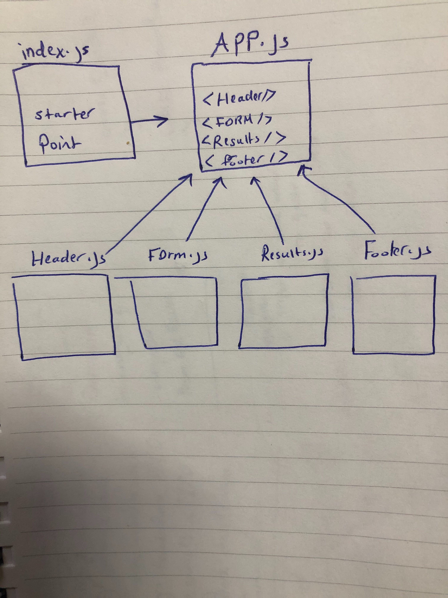

# lab-28-props-and-state

# RESTy App

### Author: Muna 

### Links and Resources

- [submission PR](https://github.com/401-advanced-javascript-muna/lab-28-props-and-state/pull/1)

#### How to initialize/run your application (where applicable)

-  `npm run start`

- api : https://swapi.co/api/people/

#### UML

Link to an image of the UML for your application and response to events

